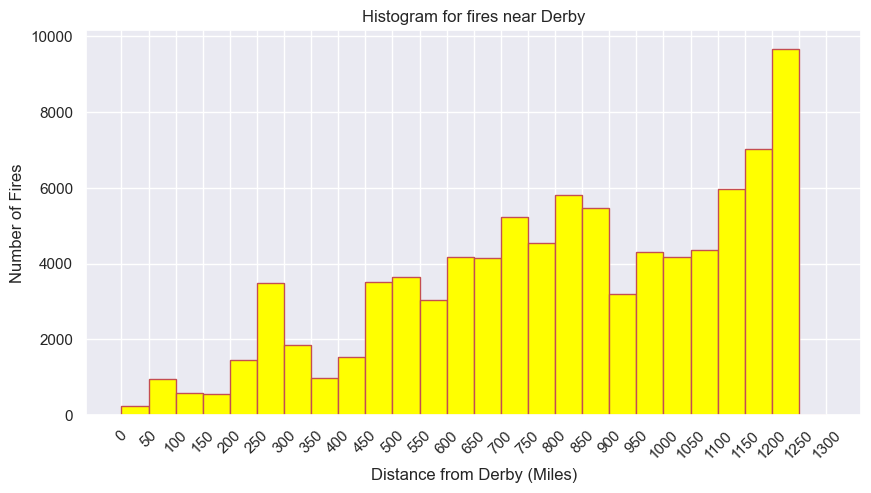
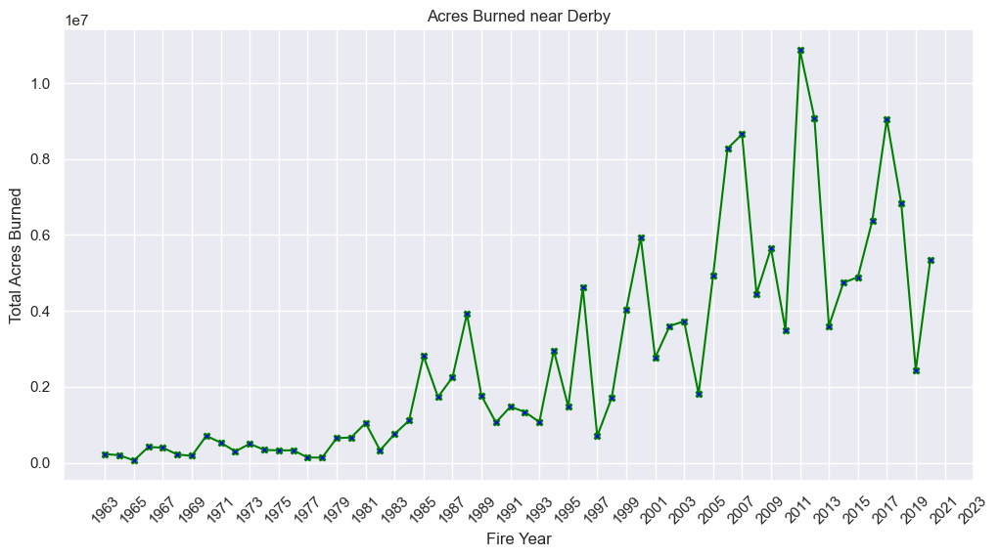
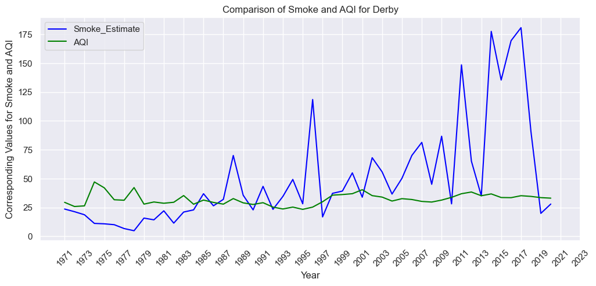
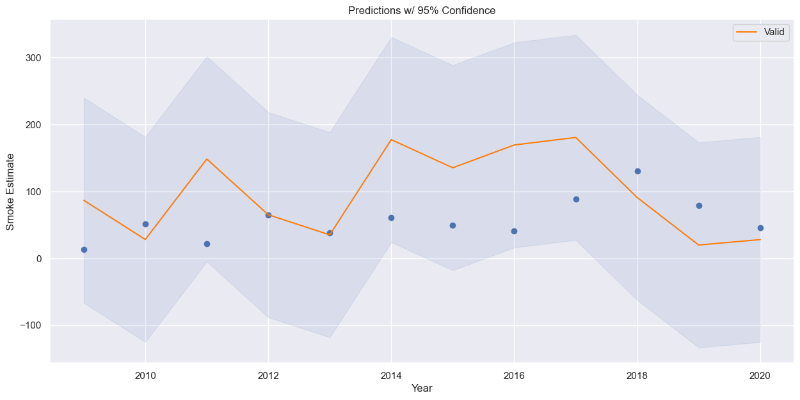
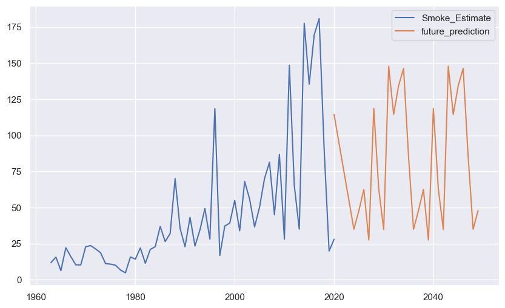
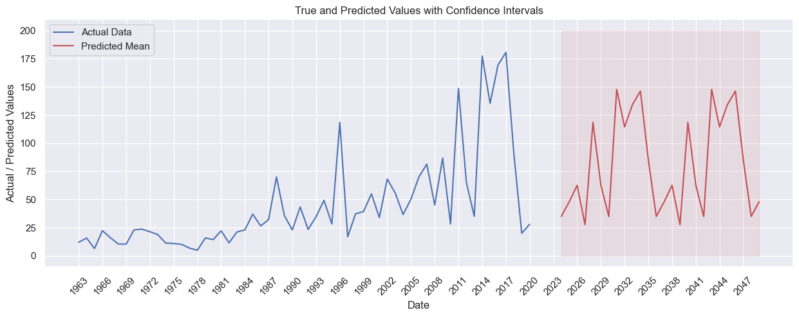

# Common Analysis - DATA512

# AIM

The goal of this submission of the project was to analyze the impact of wildfire on a specific city in the US. The end goal is to be able to inform policy makers, city managers, city councils, or other civic institutions, to make an informed plan for how they could or whether they should make plans to mitigate future impacts from wildfires.

# Key Takeaways 

1.) Derby being one of the largest suburbs in Wichita is known for its green patches which is reflected by the less number of fire cases being reported in the proximity of Derby.  However, the cases increase significantly as we move away which might be indicative of commercialization and industrialization.

2.) There has been a significant rise in the acres of land being burned all over the world over the last few years, due to a number of factors such as climate change, industrialization, commercialization etc. The data which was filtered for Derby also reflected a surge in acres of land burned in recent years. The area of land being burned had been on a constant rise and it peaked in 2011 in Derby. However, there is a noticeable shift post-2011 where it can be seen that the acres of land being burned has started to decrease though not consistently. This would be indicative of the effective measures that would have been enforced to mitigate wildfires once this reached a breaking point.

# Folder Hierarchy

├── <b>Data/</b> 
&nbsp;&nbsp;&nbsp;├── Smoke_Estimate_Annual.csv 
&nbsp;&nbsp;&nbsp;├── aqi_yoy.csv 
&nbsp;&nbsp;&nbsp;├── aqi_gaseous.csv 
&nbsp;&nbsp;&nbsp;├── aqi_particulate.csv 
├── <b>Code/</b> 
&nbsp;&nbsp;&nbsp;├── Data_Extraction_Analysis.ipynb 
&nbsp;&nbsp;&nbsp;├── Reader.py 
&nbsp;&nbsp;&nbsp;├── Wildfire_short_sample.json 
&nbsp;&nbsp;&nbsp;├── __init__.py 
&nbsp;&nbsp;&nbsp;├── test_geocalc.py 
├── <b>Output/</b> 
&nbsp;&nbsp;&nbsp;├── Visualization_1.png 
&nbsp;&nbsp;&nbsp;├── Visualization_2.png 
&nbsp;&nbsp;&nbsp;├── Visualization_3.png 
&nbsp;&nbsp;&nbsp;├── Validation_Forecast.png 
&nbsp;&nbsp;&nbsp;├── Test_Forecast.png 
&nbsp;&nbsp;&nbsp;├── Test_Forecast_with_CI.png 

# Prerequisites
Before using this code, ensure you have the following prerequisites installed:

1.) Python 3

2.) Requests

3.) Pandas

# Data Sources and Description

USGS_Wildland_Fire_Combined_Dataset.json: This contains the Combined wildland fire datasets for the United States and certain territories [Link](https://www.sciencebase.gov/catalog/item/61aa537dd34eb622f699df81) 

US City assigned for individual analysis -  [Google spreadsheet](https://docs.google.com/spreadsheets/d/1cmTW5fgU3KyH6JbrRao-qWjzu2GovKk_BkA7a-poGFw/edit)

The city under consideration for my analysis is Derby, Kansas with coordinates (37.552407, -97.261492)

# Licenses and Reference Code

This project is licensed under the MIT License. The sample codes shared for reference have been provided under the [Creative Commons CC-BY license](https://creativecommons.org/licenses/by/4.0/):

[Sample Code for GeoJSON reader](https://drive.google.com/file/d/1TwCkvdaw0MxJzW7NSDg6XxYQ0dvaS44I/view)

[Sample Code for Distance Computation](https://drive.google.com/file/d/1qNI6hji8CvDeBsnLDAhJXvaqf2gcg8UV/view)

[Sample Code for fetching data from US EPA Air Quality System API](https://drive.google.com/file/d/1bxl9qrb_52RocKNGfbZ5znHVqFDMkUzf/view)

# Reproducibility

The following steps need to followed to run this code seamlessly :

&emsp; Clone this repository to your local machine. 

&emsp; Install all the required libraries. 

&emsp; Download the jsons - USGS_Wildland_Fire_Combined_Dataset.json and USGS_Wildland_Fire_Merged_Dataset.json from  the following [link](https://www.sciencebase.gov/catalog/item/61aa537dd34eb622f699df81) by downloading the GeoJSON Files.zip folder and store these two jsons into the Data Folder 

&emsp; Run Data_Extraction_Analysis.ipynb to generate all Visualizations and output csv file stored in Data Folder 

# Considerations for Analysis and Reproducibility

&emsp; The input data file needs to be downloaded from the link mentioned under Data Sources and should be kept in the Data Folder for successful Execution of the Python Code 

&emsp; The Json Files created in the code are not present under the Data Folder due to its large size and hence need to be stored in the data folder before running the code 

&emsp; The distance threshold from the city assigned has been kept at 1250 miles for the time period between 1963 - 2023 

&emsp; The data fetched for my city(Derby, Kansas) had data for the time period for the time period between 1963 - 2020 and data was found to be missing post 2020 

&emsp; The data is not well distributed and hence fires over the entire year have been considered instead of the fires between 1st May to 31st October. 

&emsp; A modified version of ARIMA called SARIMA has been used in forecasting the Smoke Estimate for the next 25 years (2024-2049) along with confidence intervals for thos predictions  

# Output

Visualization 1 : Produce a histogram showing the number of fires occurring every 50 mile distance from your assigned city up to the max specified distance.

Visualization 2 : Produce a time series graph of total acres burned per year for the fires occurring in the specified distance from your city.

Visualization 3 : Produce a time series graph containing your fire smoke estimate for your city and the AQI estimate for your city.

Validation Forecast : Created a Validation Set to select the best and optimized parameters for the SARIMA Model

Test Forecast : Used the Trained Model to make predictions for the 2024 - 2049 period

Test Forecast with CI: Created a plot with Confidence Intervals for the prediction on 2024 - 2049 period

# License

This assignment code is released under the MIT License.
